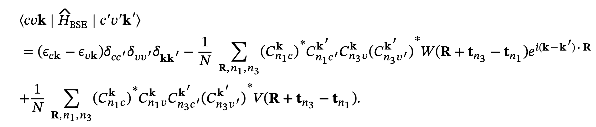

```
     _______              ____    ____   ________   ____  ____
    |_   __ \            |_   \  /   _| |_   __  | |_  _||_  _|
      | |__) |   _   __    |   \/   |     | |_ \_|   \ \  / /
      |  ___/   [ \ [  ]   | |\  /| |     |  _| _     > `' <
     _| |_       \ '/ /   _| |_\/_| |_   _| |__/ |  _/ /'`\ \_
    |_____|    [\_:  /   |_____||_____| |________| |____||____|
                \__.'
```

## 🏋️ Package
**PyMEX**: Python package for Moiré EXcitons

## 📖 Description
**PyMEX** is a Python package designed to solve the
*Bethe-Salpeter Equation (BSE)* for exciton properties in moiré systems. It
leverages *Wannier functions* as a basis to compute moiré excitons
efficiently. PyMEX currently supports **multilayers of 2D materials**, with 
support for other systems (such as bulk and 1D structures) under active 
development.
 
In the Wannier function basis, the BSE Hamiltonian can be approximated by using
the localized and orthogonal nature of Wannier functions, along with the
translational invariance of Coulomb interactions:



Please note that the released code is specifically designed for calculating
zero-momentum excitons. However, it is straightforward to implement finite
momentum excitons.

## 🚀 Features

### Scientific Features
- Compute zero-momentum **BSE eigenvalues** and **eigenvectors**  
- Calculate **optical conductivity**  
- Compute **excitonic wavefunctions**  

### Performance Optimizations
- Combines **Python** and **Cython** for efficient **looping** and performance.
- Uses **MPI** and **OpenMP** for parallel computing.
- Uses **ELPA** for efficient large-matrix diagonalization.
- Uses **HDF5** for efficient storage and handling of large datasets.

## 📂 Directory Structure

```
root/
├── src/              # Source code
├── Examples/         # Examples
├── Utility/          # Utility scripts
├── docs/             # Documentation (experimental)
├── README.md         # Project details
├── info.md           # Minimum to get started
└── .gitignore        # Git ignore rules
```

## 🛠️ Installation
**PyMEX** has been tested on Python versions 3.9 through 3.12.

### Requirements:

- Python ≥ 3.9
- numpy
- scipy
- sympy
- matplotlib (optional)
- cython
- mpi4py
- h5py
- pyyaml
- elpa (optional)

We will be moving to a pip-installable version soon. For now, please 
install the dependencies manually. We recommend using the latest versions 
of the different libraries, as they generally offer better performance.

**Tested configurations:**

- **mpi4py:** 4.0.3, 4.1.1
- **Cython:** 3.1.2, 3.2.4
- **NumPy:** 1.26.4, 2.2.6
- **SciPy:** 1.15.2, 1.15.3
- **SymPy:** 1.13.3, 1.14.0
- **h5py:** 3.14.0, 3.16.0
- **PyYAML:** 6.0.2, 6.0.3

### Build from source

```bash
git clone https://github.com/<your-org>/pymex.git
cd pymex/src
python setup.py build_ext --inplace
```

Add `src/` to your `PYTHONPATH` (or run scripts from within `src/`) so the
compiled modules can be imported.

## ▶️ Usage

See the [`Examples/`](Examples) directory for worked examples, and
[`info.md`](info.md) for the minimum steps needed to get started.

## 📬 Support
If you have any questions or encounter any bugs, please feel free to reach out.
You can contact us via the following email:
[indrajit.maity02@gmail.com](mailto:indrajit.maity02@gmail.com)

## ⌨️ Authors
This package is written and maintained by **Indrajit Maity**. If you use this
package or any part of the source code, please cite the following paper for
which this code was developed:

1. **Initial theory and framework:** Atomistic treatment of excitons in twisted bilayer 2D materials, including intralayer and interlayer excitons.  
   *[Atomistic theory of twist-angle dependent intralayer and interlayer exciton properties in twisted bilayer materials](https://arxiv.org/abs/2406.11098)* | [npj 2D Materials and Applications](https://doi.org/10.1038/s41699-025-00538-4)

2. **Transfer-matrix framework:** Extension to multilayer 2D materials using transfer-matrix methods, including moiré-trapped quadrupolar excitons in van der Waals trilayers.  
   *[Moiré trapping of quadrupolar excitons in van der Waals trilayers](https://arxiv.org/abs/2606.16557)*

### Citation:

```bibtex
@Article{Maityatomistic2025,
author={Maity, Indrajit
and Mostofi, Arash A.
and Lischner, Johannes},
title={Atomistic theory of twist-angle dependent intralayer and interlayer exciton properties in twisted bilayer materials},
journal={npj 2D Materials and Applications},
year={2025},
month={Mar},
day={04},
volume={9},
number={1},
pages={20},
issn={2397-7132},
doi={10.1038/s41699-025-00538-4},
url={https://doi.org/10.1038/s41699-025-00538-4}
}
@Article{Maitymoire2026,
  author={Maity, Indrajit and Mostofi, Arash A. and Rubio, Ángel and Lischner, Johannes},
  title={Moiré trapping of quadrupolar excitons in van der Waals trilayers},
  journal={arXiv preprint},
  year={2026},
  eprint={2606.16557},
  archivePrefix={arXiv},
  primaryClass={cond-mat.mtrl-sci},
  doi={10.48550/arXiv.2606.16557},
  url={https://arxiv.org/abs/2606.16557}
}
```

## 📄 License

PyMEX is released under the **GNU General Public License v3.0 (GPL-3.0)**.
See the [LICENSE](LICENSE) file for details.

The GPL license permits the use, modification, and redistribution of PyMEX,
including its use in open-source software, subject to the terms of the
license. Commercial licensing options may be made available separately by
the copyright holder.

